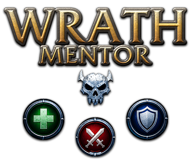
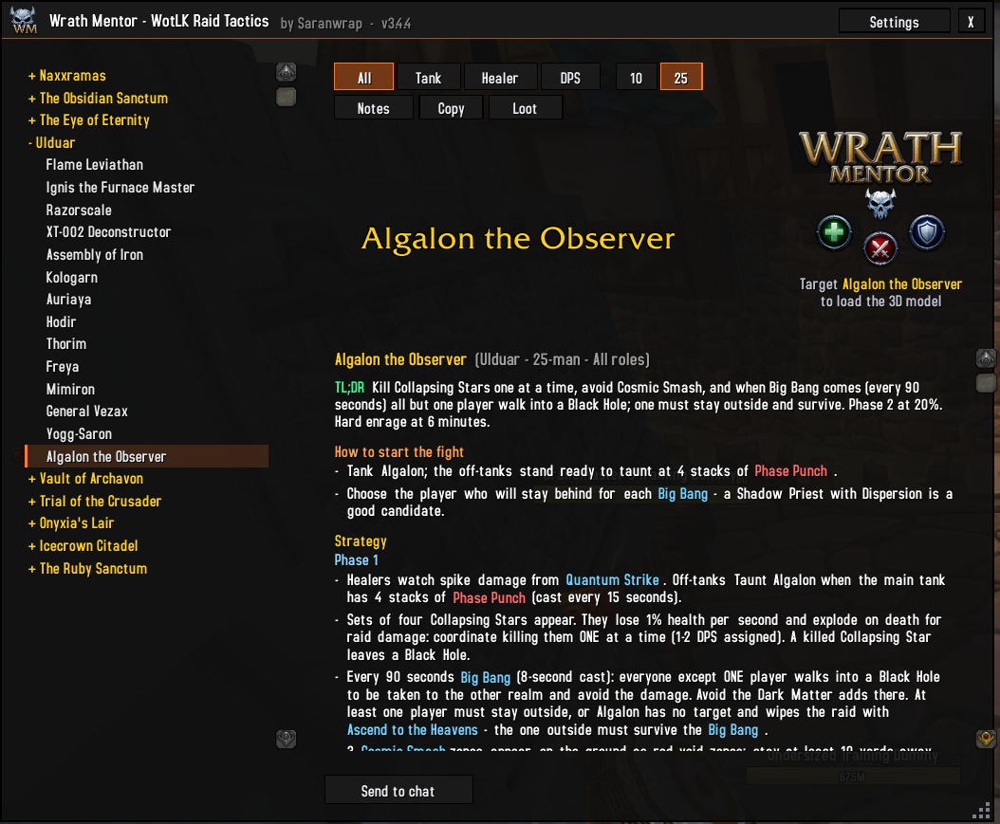
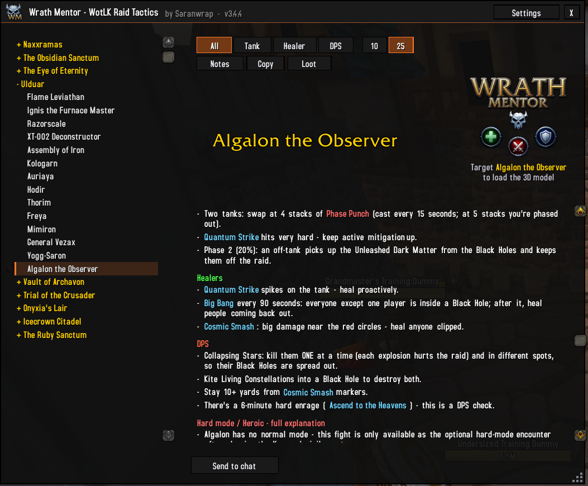
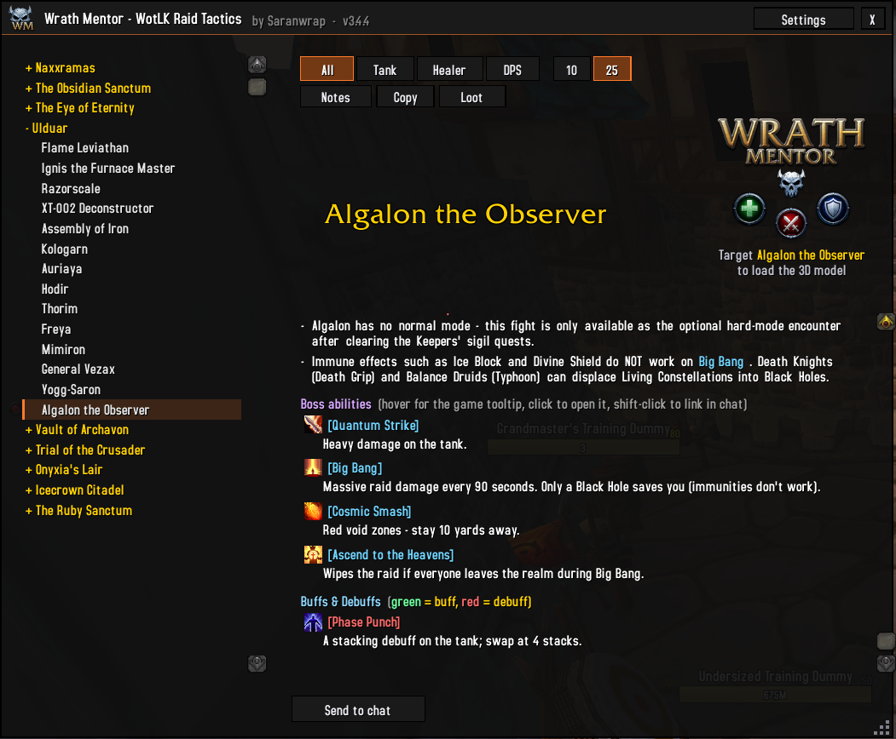
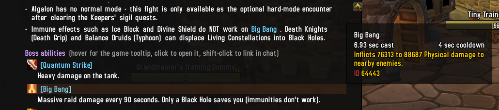
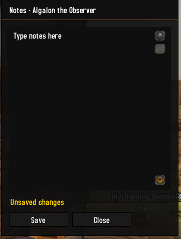
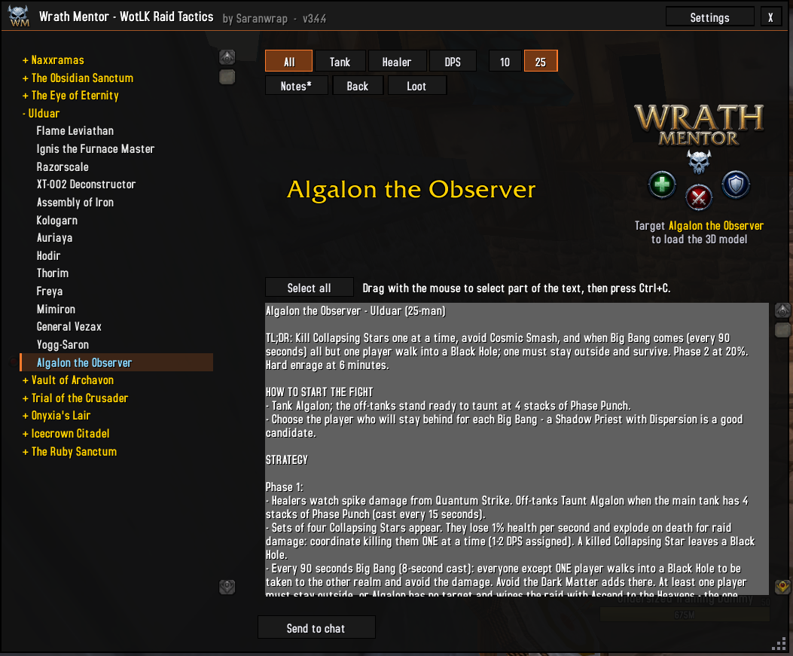
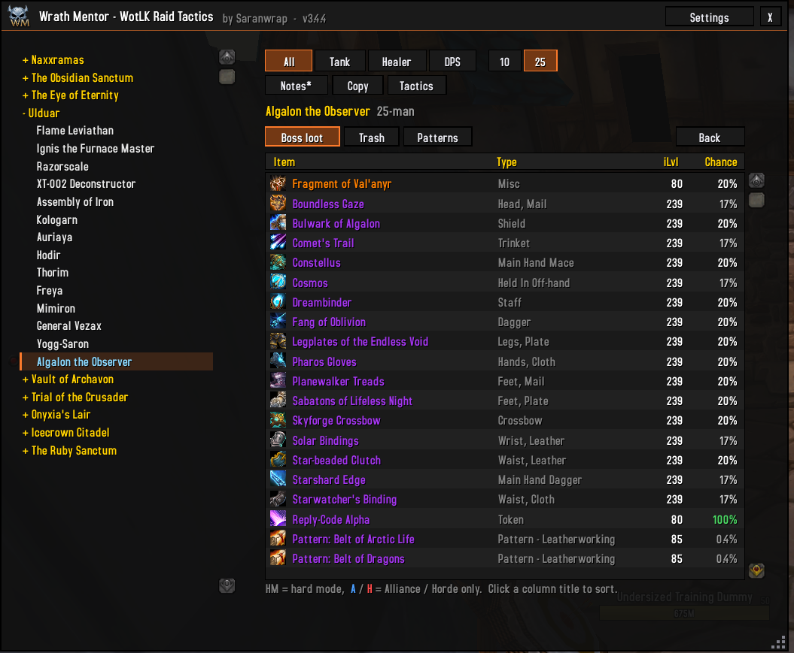
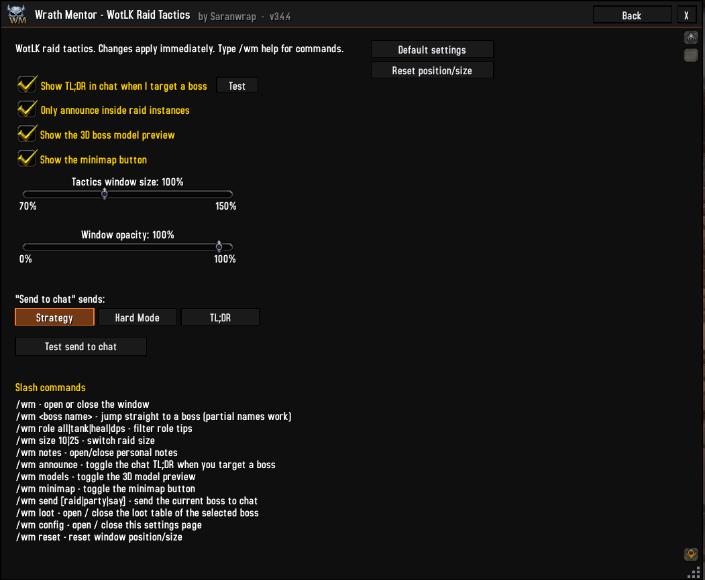

# Wrath Mentor

**In-game raid tactics for every Wrath of the Lich King raid boss.** For World of Warcraft 3.3.5a.

Version 3.4.4 · by Saranwrap

Raids: Naxxramas, The Obsidian Sanctum, The Eye of Eternity, Ulduar, Vault of Archavon, Trial of the Crusader, Onyxia's Lair, Icecrown Citadel and The Ruby Sanctum.

---

## Installation

1. Close the game.
2. Download the zip (on GitHub: **Code → Download ZIP**) and open it.
3. Copy the **`WrathMentor`** folder into `<WoW folder>\Interface\AddOns\`. Keep its name: the addon loads from it.
4. Start the game.

**Updating:** close the game, **delete the old `WrathMentor` folder completely** (and any `Wrath-Mentor-main` folder from an older download, so only one copy is installed), then copy in the new one. Copying over the old folder can keep old files (images in particular), and the game only loads new files after a full restart, not after `/reload`.

## Quick start

- `/wm` opens the tactics window.
- `/wm lich` opens a boss directly (part of the name is enough).
- Left-click the minimap button to open the window, right-click it for the settings.
- **Settings** (title bar button) opens inside the window; press **Back** to return.

---

## The tactics window

- Pick a raid and a boss in the list on the left.
- **All / Tank / Healer / DPS**: show only the tips for your role.
- **10 / 25**: switch the text between the 10-man and 25-man version.
- Each boss page has a TL;DR, how to start the fight, the strategy, role tips, hard mode / heroic, then the full list of boss abilities and buffs & debuffs.
- Ability names are links: hover for the spell tooltip, click to open it, shift-click to link it in chat. Blue = ability, green = buff, red = debuff.
- **Notes**: your own notes for the selected boss (press **Save**). Bosses with notes are shown in blue in the list.
- **Copy**: shows the page as plain text, so you can select it and press Ctrl+C.
- **Loot**: shows the boss's loot table instead of the tactics (press **Back** or **Tactics** to return).
- Resize the window by dragging the bottom-right corner.

## Loot tables

Press **Loot** (next to Copy) or type `/wm loot`.

- The selected boss's loot with the item type, item level and drop chance.
- 10 / 25 follows the size buttons. A **Heroic** button for Trial of the Crusader, Icecrown Citadel and The Ruby Sanctum.
- **Trash**: the raid's trash epics (chance per mob). **Patterns**: patterns and recipes with the boss or trash they drop from. Trial of the Crusader also has **Tribute** (the heroic tribute chest).
- **HM** = only in hard mode (Ulduar hard modes, Sartharion with drakes up…).
- **A** (blue) / **H** (red) after a name = Alliance / Horde only item.
- Click a column title (Item, Type, iLvl, Chance) to sort, again to reverse.
- Hover an item for its tooltip, shift-click to link it, ctrl-click to try it on.

Drop chances come from the AzerothCore world database (the core ChromieCraft runs on). A server can change its loot, so treat them as a guide.

## 3D boss model

Target the boss to load its 3D model in the top-right corner of its page. The model stays available for the rest of the session, even after you drop the target. Until then, the spot shows the Wrath Mentor artwork with a "Target <boss>" reminder. Turn it off in the settings or with `/wm models`.

## Chat announcement

When you target a raid boss, you get a chat line with its TL;DR and a link to its guide (shift-click the link to open it). Only you see it, and it shows once per fight. In the settings: turn it on or off, choose raid instances only, and press **Test** to see it now.

## Send to chat

**Send to chat** posts the selected boss to your group. Choose what it sends in the settings:

| Option | |
| --- | --- |
| **Strategy** | Strategy + ability links (default) |
| **Hard Mode** | Hard mode section + ability links |
| **TL;DR** | One short summary line |

It goes to the chat box you have open (raid, party, say, guild…). With no chat box open it goes to raid, or party, or only your own chat window when you are solo. **Test send to chat** in the settings shows exactly what would be posted, without sending anything.

---

## Settings

`/wm config`, or **Settings** in the title bar. It opens inside the main window (scroll for the rest); press **Back** to return.

- Chat announcement on / off, raid instances only, Test button
- 3D model preview on / off
- Minimap button on / off
- Window size and window opacity sliders
- Send to chat content (Strategy / Hard Mode / TL;DR) and Test send to chat
- Default settings: puts every setting back to its default
- Reset position / size: puts the window back in the middle at its default size

## Commands

| Command | |
| --- | --- |
| `/wm` | Open or close the window |
| `/wm <boss name>` | Open a boss (partial names work: `/wm sapph`, `/wm yogg`) |
| `/wm role all\|tank\|heal\|dps` | Role filter |
| `/wm size 10\|25` | 10-man or 25-man text |
| `/wm notes` | Open or close the notes box |
| `/wm loot` | Loot table of the selected boss on or off |
| `/wm announce` | Chat announcement on or off |
| `/wm models` | 3D model preview on or off |
| `/wm minimap` | Minimap button on or off |
| `/wm send [raid\|party\|say]` | Send the selected boss to chat |
| `/wm config` | Open or close the settings |
| `/wm reset` | Reset the window position and size |
| `/wm help` | List the commands in chat |
| `/wm modeltest` | Explains why a 3D model is not showing |
| `/wm checklinks` | Shows how many ability links work on your client |

---

## Editing the tactics

The text lives in the `Data_*.lua` files (one per raid group). Boss fields: `name`, `aliases`, `tldr`, `start`, `general`, `tank`, `heal`, `dps`, `hard`, `abilities`.

| Syntax | |
| --- | --- |
| `[10] text` / `[25] text` | Line only shown in 10-man / 25-man |
| `#{a/b}` | `a` in 10-man, `b` in 25-man |
| `## Title` | Sub-heading inside a section |
| `{ ids = { 10-man id, 25-man id }, name = "Exact Spell Name", desc = "..." }` | An ability |

If the name shown in the guide differs from the spell's in-game name, add `spellName = "In-game Name"` (for example, Malygos' Deep Breath is the spell "Surge of Power"). Boss names must match the in-game name (English client) for the chat announcement to work. The `npcId` field in some bosses is no longer used and can be ignored.

## Links

- GitHub: https://github.com/saranwrap04/Wrath-Mentor
- Warperia: https://warperia.com/addon-wotlk/wrath-mentor/

---

## Screenshots

<b>Boss tactics</b>

<b>Role tips: tanks, healers, DPS</b>

<b>Boss abilities and buffs / debuffs</b>

<b>Ability tooltip on hover</b>

<b>Personal notes</b>

<b>Copy the tactics</b>

<b>Loot table</b>

<b>Settings</b>

